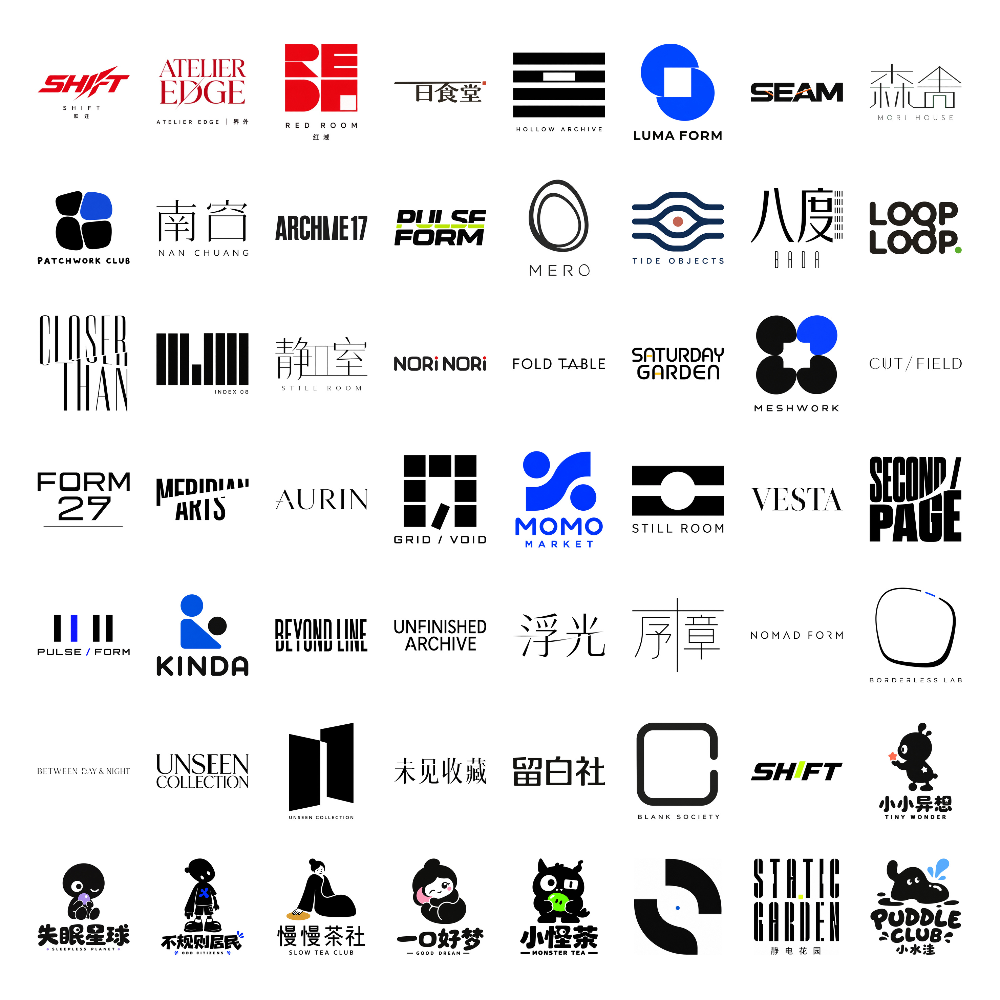

# Minimal Logo Design

用于为新品牌创作原创、极简且具有识别度的 Logo 方向。它不会把所有项目套成同一种黑白建筑图标，而是根据品牌气质选择更合适的主导语言：定制字标、抽象几何、图形系统或趣味手绘形。



## 适合什么

- 建筑、艺术、摄影、音乐、时尚、家具、酒店与生活方式品牌
- 中文／英文／双语品牌的定制字标探索
- 需要高识别度图形标、抽象文化符号或年轻趣味角色的项目
- 需要快速比较多个差异明显的 Logo 方向时

不适用于复刻现有品牌、直接套用参考 Logo，或将现成字体当作最终商标。

## 安装

```bash
git clone https://github.com/dacnay816y62-hub/minimal-logo-design.git \
  ~/.codex/skills/minimal-logo-design
```

重新打开 Codex 后，可在对话中直接使用 `$minimal-logo-design`，也可直接描述 Logo 设计需求，由 Codex 自动选择该 Skill。

## 最小调用方式

```text
$minimal-logo-design

为「浮光 AFTERLIGHT」做 3 个 1:1 Logo 方向。
它是一个摄影与视觉艺术工作室，关键词是：光、时间、瞬间、观察。
气质要安静、诗意、国际化；不要相机图标。
请使用白底 JPG 预览，并同步提供白底 PNG 保存文件。
```

## 怎样写 Brief

信息越明确，方向判断越准确。建议至少提供：

| 信息 | 示例 |
| --- | --- |
| 品牌名 | 浮光 / AFTERLIGHT |
| 行业与受众 | 摄影工作室，面向艺术与文化客户 |
| 一句话理念 | 记录短暂出现的光与记忆 |
| 关键词 | 光、时间、轻盈、观察 |
| 不要什么 | 不要相机、镜头、胶片图标 |
| 输出数量 | 3 个方向，1:1 白底 |

可选补充：主要使用语言、应用场景、颜色偏好、需要更商业还是更实验，以及你喜欢的参考图所体现的**抽象特征**。参考图用于理解气质，不用于复刻。

## Skill 如何做设计判断

每个方向开始前都会先回答：**“这是谁的主角？”** 主角只能是以下之一：

- **定制字标**：适合时尚、文化、高端服务和需要名称沉淀的品牌。
- **抽象几何标**：适合空间、技术、结构、连接与秩序。
- **图形／图案系统**：适合节奏、收藏、传播和情绪体验。
- **趣味手绘形**：适合年轻商业、潮玩、食品或社区品牌。

主标遵循 `70 / 20 / 10`：70% 是主识别，20% 是必要的支持语言或符号，10% 才是描述信息。每个方向只保留一个主记忆动作，避免把 Logo、口号、编号、网格和宣传信息堆在同一张画面里。

### 文字不是“选字体”

有中文、英文或数字时，Skill 会优先进行原创的字形设计，而不是把现成字体直接当 Logo。可使用的动作包括：比例调整、字腔设计、局部切割、模块重组、字距和层级控制。动作以可读性为前提：观者应先读出品牌名，再记住结构。

中文的处理从笔画骨架、留白、重心与字间关系出发。安静、高端、人文方向优先使用低可见度改造；潮玩、音乐、先锋艺术才使用更显性的缺口、错位或笔触角色。

## 默认交付

每个方向默认输出：

1. **核心 Logo**：只呈现一个主角，适合首先比较识别度。
2. **双语锁定版**：仅在需要国际化阅读、菜单、导视或出版传播时组合中英文。
3. **延展系统版**：将模块、网格或图形关系用于海报、包装和导视；不与核心 Logo 混在同一张主标图中。

对话中只展示不透明纯白背景的 **JPG**。每张成品同时保存同尺寸、同样纯白背景的 **PNG**，用于下载与归档。

## 示例提示词

### 高端餐饮

```text
为「一隅 / ONE CORNER」设计一个核心 Logo。
现代东方料理空间，关键词：季节、食材、空间、停留。
主角优先是低可见度改造的中文定制字标；英文以共享基线的方式辅助。
不要筷子、米饭、传统纹样。黑色主体，只允许一个很小的砖红色重音。
```

### 先锋音乐

```text
为「静电花园 / STATIC GARDEN」做 3 个 Logo 方向。
实验电子音乐厂牌，关键词：重复、延迟、振动、夜晚。
其中至少一方向必须是可读的动态字标，不要音符或耳机。
```

### 年轻趣味品牌

```text
为「小水洼 / PUDDLE CLUB」设计 Logo。
城市零食与礼物品牌，气质友好、怪趣、有收藏感。
主角是一个可单色使用的手绘小角色；文字保留清晰识读，不要普通卡通头像。
```

## 质量底线

- 不复制参考案例、在世设计师风格或现有商标。
- 不用行业的直白图标替代概念：酒店不画山，科技不画芯片，摄影不画相机。
- 文字必须拼写准确、中文可读；出现伪字或错字时只能视作草图。
- 缩小后仍应读得出品牌名，图形也应能单色成立。
- 色彩只承担一个功能，例如断点、入口或节奏，而不是无目的装饰。

## 仓库结构

```text
minimal-logo-design/
├── SKILL.md                         # Skill 的完整设计规则
├── README.md                        # 使用说明与示例
└── assets/
    └── logo-examples-25x25cm.jpg    # 56 个方向的白底示例总览
```
